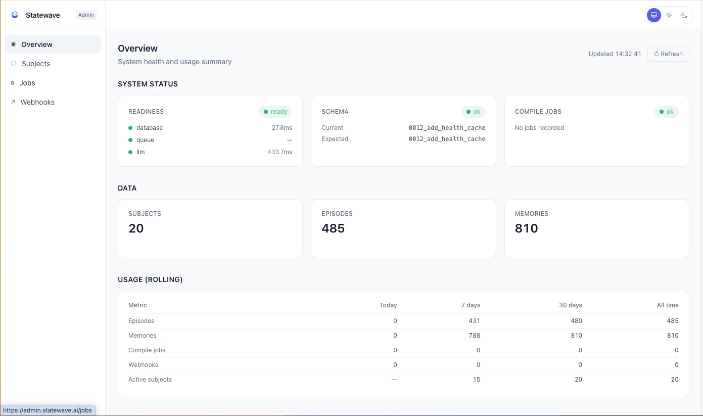
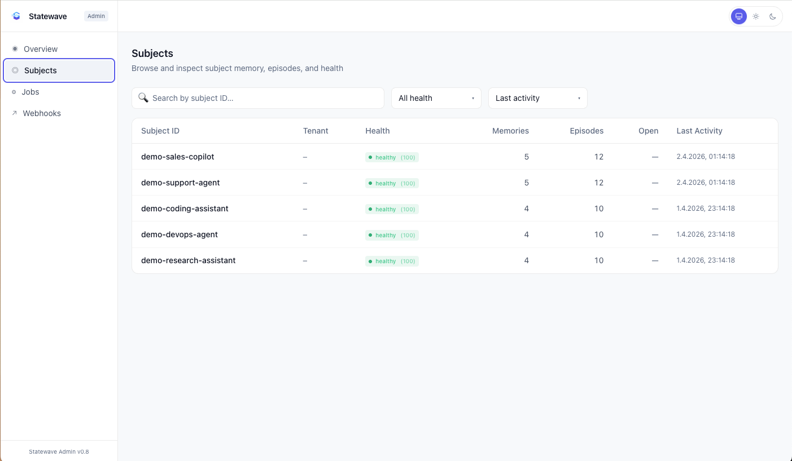

# statewave-admin

Operator console for Statewave instances — system health, subject explorer, compile jobs, webhook status, and usage metering.

> **Part of the Statewave ecosystem:** [Server](https://github.com/smaramwbc/statewave) · [Python SDK](https://github.com/smaramwbc/statewave-py) · [TypeScript SDK](https://github.com/smaramwbc/statewave-ts) · [Docs](https://github.com/smaramwbc/statewave-docs) · [Examples](https://github.com/smaramwbc/statewave-examples) · [Website + demo](https://statewave.ai) · **Admin**
>
> 📋 **Issues & feature requests:** [statewave/issues](https://github.com/smaramwbc/statewave/issues) (centralized tracker)

> **Frontend role:** This is the **operator/admin console** — a privileged dashboard for monitoring and operating Statewave. For the marketing website and embedded interactive demo, see [statewave-web](https://github.com/smaramwbc/statewave-web).

> ⚠️ **Privileged interface — secure-by-default.** statewave-admin ships with a built-in password gate enabled by default. In production, `ADMIN_PASSWORD` and `ADMIN_SESSION_SECRET` are required; without them, login and `/api/proxy` are blocked. The console is intended for **private deployment** — community users should run their own admin connected to their own backend. `admin.statewave.ai` is private and is not a public demo. For public demos, use [statewave-demo](https://github.com/smaramwbc/statewave-web).

## Screenshots

**Overview** — system readiness, schema/migration state, compile job health, data counts, and rolling usage:



**Subjects** — search, filter by health, and drill into per-subject memories, episodes, and SLA state:



## Vendor-neutral by design

Nothing in this repo is bound to a specific cloud or PaaS. The runtime is a small standalone Node HTTP server (zero npm runtime dependencies — only `node:*` built-ins) plus a Vite build of the React UI. Deploy it:

- on any container runtime (Docker, Kubernetes, Nomad, ECS, App Runner, Cloud Run, Render, …)
- on a bare VPS or VM behind nginx / Caddy / Traefik / HAProxy
- on any PaaS that runs Node (no platform-specific config)
- behind any identity-aware proxy (Cloudflare Access, OAuth2 Proxy, AWS ALB + Cognito, IAP, Pomerium, …)

The same auth handlers run in dev (Vite middleware), in tests, and in production. See [DEPLOYMENT.md](DEPLOYMENT.md) for runnable examples per host.

## Quick start (local dev)

```bash
npm install
cp .env.example .env.local
# in .env.local set ADMIN_AUTH_DISABLED=true for local-only dev
npm run dev
```

Open http://localhost:5173. A bright warning banner appears across the top whenever `ADMIN_AUTH_DISABLED=true`.

## Quick start (production-style local)

```bash
npm install
export STATEWAVE_API_URL=http://localhost:8100
export ADMIN_PASSWORD="$(openssl rand -base64 32)"
export ADMIN_SESSION_SECRET="$(openssl rand -hex 32)"
npm run build
npm start
# → http://localhost:8080 — sign in with the password you just generated
```

## Desktop app

A self-contained cross-platform desktop bundle is available for macOS, Linux, and Windows. It wraps the admin web UI in a Tauri v2 window and embeds the standalone Node admin server (`server/index.ts`) as a sidecar — one drag-to-install bundle, no separate server to set up, no browser tab to manage. Server fixes reach the desktop bundle from the same source.

**Download:** see the [latest desktop release](https://github.com/smaramwbc/statewave-admin/releases) for `.dmg` (macOS Apple Silicon), `.AppImage` and `.deb` (Linux x64), and `.msi` (Windows x64).

> **Intel Macs:** native Intel binaries are not shipped. Install the Apple Silicon `.dmg` — macOS' built-in Rosetta 2 translates it transparently. (Apple stopped selling Intel Macs in 2023; if you're on one, you've already used Rosetta many times.)

### First launch (unsigned bundles)

The desktop app is distributed exclusively through GitHub releases — there are no plans to ship to the App Store or Microsoft Store, so the bundles are **unsigned**. The first launch trips your platform's unidentified-developer guard once; the fix is per-platform:

- **macOS** — open the `.dmg`, drag the app to `/Applications`, then **right-click → Open** the first time. After that, double-click works normally. Alternative: `xattr -cr "/Applications/Statewave Admin.app"`.
- **Windows** — run the `.msi`. SmartScreen will show "Windows protected your PC" — click **More info → Run anyway**.
- **Linux** — the `.deb` and `.AppImage` install with no warning. For `.AppImage`: `chmod +x 'Statewave Admin*.AppImage' && ./'Statewave Admin*.AppImage'`.

### After first launch

A one-time wizard collects your **Statewave API URL** and **API key** (the same values the web build expects in `STATEWAVE_API_URL` / `STATEWAVE_API_KEY`). The app then spawns the embedded admin server on a random localhost port and opens the dashboard.

To switch backends or wipe credentials, use **Statewave Admin → Disconnect Backend…** in the menu bar — it clears the stored config and returns you to the wizard.

### CLI

Each desktop release also publishes a standalone `statewave-admin` CLI binary for each platform (attached to the same release page). It talks HTTP to any admin server — your hosted deployment, a self-hosted instance, or the desktop app's embedded sidecar — and surfaces every operation the web UI does, plus an interactive menu and fuzzy `search` for discoverability:

```sh
statewave-admin              # interactive menu (auto-prompts login if needed)
statewave-admin search "delete subject"
statewave-admin subjects bulk-delete --prefix old_ --preview-only
```

### Building from source

See [desktop/README.md](desktop/README.md) for the full Cargo workspace + Bun + Tauri toolchain recipe, the architecture diagram, and the `.github/workflows/desktop-release.yml` release pipeline.

## Configuration

All variables are **server-side only**. None may use a `VITE_*` prefix — those would be baked into the public bundle.

| Variable | Default | Description |
|----------|---------|-------------|
| `STATEWAVE_API_URL` | _(none)_ | Statewave backend base URL (server-side proxy target) |
| `STATEWAVE_API_KEY` | _(none)_ | API key forwarded as `X-API-Key` to the backend |
| `ADMIN_PASSWORD` | _(none)_ | Required in production unless `ADMIN_AUTH_DISABLED=true` |
| `ADMIN_SESSION_SECRET` | _(none)_ | HMAC secret for signing the session cookie. Required in production unless disabled |
| `ADMIN_SESSION_TTL_HOURS` | `12` | Session cookie lifetime in hours |
| `ADMIN_AUTH_DISABLED` | `false` | Local-dev escape hatch; shows a warning banner when true |
| `ADMIN_TRUST_GATEWAY_HEADERS` | `false` | Accept identity from a fronting proxy (Cloudflare Access etc.) |
| `ADMIN_ALLOWED_EMAILS` | _(empty)_ | Comma-separated allowlist for gateway-supplied emails |
| `ADMIN_SMOKE_DISABLED` | `false` | Set to `true` to disable the first-admin-run smoke check |
| `ADMIN_SMOKE_STATE_DIR` | _(none)_ | Optional directory for persisting smoke status across restarts |
| `ADMIN_SELF_HEALING_EVAL_ENABLED` | `false` | Master switch for the Self-Healing Eval feature |
| `ADMIN_EVAL_LLM_PROVIDER` | _(none)_ | LLM judge provider — `openai`, `anthropic`, or `openai-compatible` |
| `ADMIN_EVAL_LLM_MODEL` | _(none)_ | Judge model name (e.g. `gpt-4o-mini`, `claude-3-5-sonnet-latest`) |
| `ADMIN_EVAL_LLM_API_KEY` | _(none)_ | Judge provider API key (server-side only) |
| `ADMIN_EVAL_LLM_BASE_URL` | _(none)_ | Required when provider is `openai-compatible`. Use this for **LiteLLM proxies** (`http://localhost:4000`, hosted LiteLLM gateways) or **Azure OpenAI** access fronted by LiteLLM. Ignored for raw `openai` / `anthropic`. |
| `ADMIN_DEMO_AGENT_URL` | _(none)_ | HTTP endpoint of the demo support agent the eval will talk to |
| `ADMIN_DEMO_AGENT_API_KEY` | _(none)_ | Optional bearer token sent to the demo agent |
| `ADMIN_DEMO_AGENT_BODY_FORMAT` | `default` | `default` (eval-native shape) or `statewave-web` (translates to `{messages, mode, persona}` so the existing `/api/widget-chat` endpoint in [statewave-web](https://github.com/smaramwbc/statewave-web) can be used as the demo agent without changes) |
| `ADMIN_DEMO_AGENT_PERSONA` | `statewave-support` | Persona id used only when `ADMIN_DEMO_AGENT_BODY_FORMAT=statewave-web`. Defaults to the docs-grounded persona. |
| `ADMIN_DEMO_WEBHOOK_URL` | _(none)_ | **Reserved / informational in this MVP.** Webhook delivery validation reuses the existing Statewave smoke-check path — the eval observes whatever destination `STATEWAVE_WEBHOOK_URL` is set to on the Statewave server. |
| `ADMIN_EVAL_STORAGE_PATH` | _(none)_ | Optional directory for persisting eval reports across restarts |
| `PORT` | `8080` | Standalone Node server listen port |
| `HOST` | `0.0.0.0` | Standalone Node server bind host |
| `ADMIN_STATIC_DIR` | `./dist` | Path to the built static frontend |

## Scripts

| Command | Description |
|---------|-------------|
| `npm run dev` | Vite dev server + auth middleware in-process |
| `npm run build` | Frontend (`dist/`) + Node server (`dist-server/`) |
| `npm run build:client` | Frontend only |
| `npm run build:server` | Node server only |
| `npm start` | Run the standalone Node server (after build) |
| `npm run preview` | Preview the static frontend (no auth — for asset checks only) |
| `npm test` | Run Vitest |
| `npm run lint` | ESLint |
| `npm run typecheck` | TypeScript across client + server |

## Stack

- Vite 8 + React 19 + TypeScript
- Tailwind CSS v4
- Vitest + Testing Library
- Standalone Node HTTP server with **zero npm runtime dependencies**

## PWA / installable app

The admin is installable as a Progressive Web App. On Chrome/Edge/Brave/Android the browser surfaces a native install affordance plus a built-in dismissible "Install app" pill in the top bar; on iOS Safari the user can "Add to Home Screen" via the Share menu.

### What ships

- `public/manifest.webmanifest` — the install contract: name, scope, theme/background colors aligned to the Statewave brand, plus 192/512/maskable icons.
- `public/icon-192.png`, `icon-512.png`, `icon-maskable-192.png`, `icon-maskable-512.png`, `apple-touch-icon.png` — generated from `public/favicon.svg` via ImageMagick. The maskable variants render the brand mark in the inner 60% safe-zone over a brand-dark background so Android's adaptive-icon mask doesn't crop it.
- `public/sw.js` — hand-rolled, no Workbox. Auditable in one screen.
- `public/offline.html` — a simple offline fallback served only when the network is unreachable.
- `src/lib/sw-register.ts` — registers the SW after first paint, polls for updates hourly, exposes `applyPendingUpdate()` for the "Reload now" toast and `purgeCachesAndUnregister()` for logout.
- `src/components/InstallPrompt.tsx` — non-intrusive header pill that renders only when the browser fires `beforeinstallprompt`; dismissals are remembered for 30 days.

### Service worker caching policy

The admin app is privileged. The SW is deliberately conservative.

| Pattern | Strategy | Why |
|---|---|---|
| `/api/auth/*` | **Bypass** (never cached) | Login/logout/session must always reach the origin. |
| `/api/proxy/*` | **Bypass** (never cached) | Every privileged backend call (subjects, memories, episodes, jobs, webhooks, dashboard, usage, tenants) goes through this — caching it would leak admin data. |
| Cross-origin requests | **Bypass** | We never want the SW to mediate third-party traffic. |
| Non-GET methods | **Bypass** | Mutations should never be cached. |
| `Range` / partial requests | **Bypass** | Partial responses aren't safe to cache. |
| `cache: no-store` requests | **Bypass** | Honors the application's explicit opt-out. |
| `/index.html`, `/sw.js`, `/manifest.webmanifest`, `/offline.html` | Network-first with shell fallback | These must be reachable when offline but always fresh online. |
| Vite content-hashed assets (`/assets/*`) | Stale-while-revalidate, opaque-rejected | The hash invalidates them on every release, so a stale cache hit is always a correct old build. |

A successful logout calls `purgeCachesAndUnregister()` which wipes every SW cache and unregisters the worker — defense in depth on top of the per-request bypass list.

### Security & privacy

- **No tokens in cache.** Auth is HttpOnly session cookies; there is no Bearer token in the front-end and the SW never sees one.
- **No subject / memory / episode data in cache.** Verified by `tests/sw-policy.test.ts`.
- **No opaque (cross-origin no-cors) responses cached.** The SW only puts `response.type === 'basic'` results into the cache.
- **Update flow is explicit.** A waiting SW does not auto-take-over — the user sees a Sonner toast inviting them to reload. This avoids losing in-flight admin work.
- **Logout is destructive.** The shell cache is wiped and the SW unregisters so a different account starting on the same browser/device gets a clean shell.

### Updating icons or manifest

1. Edit `public/favicon.svg` (the source of truth).
2. Regenerate the PNG sizes:
   ```bash
   cd public
   magick -background none -density 600 favicon.svg -resize 192x192 icon-192.png
   magick -background none -density 600 favicon.svg -resize 512x512 icon-512.png
   magick -background none -density 600 favicon.svg -resize 180x180 apple-touch-icon.png
   ```
   For maskable variants, edit the inner `<g transform>` in the local maskable SVG so the artwork sits inside the 80% safe zone, then export 192/512.
3. Update `public/manifest.webmanifest` if you renamed any file.
4. Bump `CACHE_VERSION` in `public/sw.js` so existing installs roll over to the new icons on the next visit.
5. Run `npm test` — `tests/pwa-manifest.test.ts` verifies every manifest icon exists on disk and the head wiring is intact.

### Verifying installability

- **Chrome DevTools → Application → Manifest** must show no errors.
- **DevTools → Application → Service workers** must show `sw.js` registered and active.
- **Lighthouse → PWA** runs against the production build via `npm run build && npm run start` and should show "Installable" green.
- **iOS** behavior is verified manually — Add to Home Screen, confirm the icon, status-bar style, and that the offline page appears when airplane mode is toggled.

## First-admin-run smoke check

The **Diagnostics** page (`/diagnostics`) hosts a self-test that validates a fresh admin install is wired up to a healthy Statewave backend. The first time an authenticated operator opens the page against a deployment that has never run the check, the admin server transparently:

1. Probes `/readyz` and `/admin/dashboard` to confirm the backend is reachable and the API key has admin scope.
2. Ingests a tiny demo episode against a clearly named subject — `statewave-demo:first-admin-run` — and triggers an **async** compile so a row lands in `compile_jobs` and the operator can see the artifact under **/jobs**. The admin polls the job status until it leaves `pending`/`running`.
3. Reads `/admin/webhooks/stats` before and after the demo run. If the count never changes, no webhook URL is configured on the backend and the card reports a neutral *"Webhooks not configured"* state with a hint to set `STATEWAVE_WEBHOOK_URL` (e.g. to `https://webhook.site/<id>` or a local sink) and rerun. If the count rises, the most recent event's delivery status (`delivered` / `pending` / `dead_letter`) is shown along with a link to **/webhooks**.

### Dashboard banner

The Overview page renders a one-line banner only when there is something to act on:

- **First-run pending** *(neutral)* — smoke has never run on this deployment. Banner: *"First-run system check pending · Run now →"* (links to `/diagnostics`).
- **Last run failed or partial** *(amber)* — banner: *"System smoke check needs attention · View diagnostics →"*.
- **Last run succeeded** *(no banner)* — Overview stays clean.

The smoke flow itself never runs from the Dashboard — only from `/diagnostics`. This keeps Overview focused on live operational metrics and lets Diagnostics grow into a home for additional probes (webhook tester, connector validators, etc.) over time.

The result lives in-process by default so it survives admin reloads but resets on restart. Set `ADMIN_SMOKE_STATE_DIR=/var/lib/statewave-admin` (or any writable directory) to persist last-run state across restarts.

### Endpoints

Both endpoints sit behind the same auth gate as `/api/proxy` — no secrets ever leave the server, and unauthenticated browsers cannot trigger demo writes.

| Method + Path | Purpose |
|---|---|
| `GET  /api/admin/smoke/status` | Read the most recent run's result + whether the deployment has ever run the check |
| `POST /api/admin/smoke/run`    | Run the smoke flow now (single-flighted server-side; concurrent calls share one upstream run) |

### Idempotency

- The demo subject id is fixed (`statewave-demo:first-admin-run`) so re-running the check does not create unbounded subjects.
- The server single-flights concurrent runs, so the dashboard auto-fire + a manual click cannot pile on duplicate demo episodes.
- A small `localStorage` flag in the browser debounces the auto-fire across reloads while a slow run is in flight.

### Disabling

Set `ADMIN_SMOKE_DISABLED=true` to opt out entirely. The card renders a neutral *"Smoke check disabled"* state and the run endpoint returns immediately without contacting the backend.

### Manual rerun

The card always exposes a **Run smoke check again** button. Use it after fixing a backend issue to confirm the wiring is healthy without restarting the admin process.

## Self-Healing Eval

A second card on the **Diagnostics** page (`/diagnostics`) runs an LLM-graded multi-turn conversation against a demo support agent and produces an actionable improvement report. It is admin-triggered only — it never runs on its own.

### Availability

The card stays disabled until **all** of the following are set on the admin server:

- `ADMIN_SELF_HEALING_EVAL_ENABLED=true`
- `ADMIN_EVAL_LLM_PROVIDER` (`openai` | `anthropic` | `openai-compatible`)
- `ADMIN_EVAL_LLM_MODEL` (e.g. `gpt-4o-mini`)
- `ADMIN_EVAL_LLM_API_KEY`
- `ADMIN_EVAL_LLM_BASE_URL` — **required** when provider is `openai-compatible`. Point this at a [LiteLLM proxy](https://docs.litellm.ai/docs/simple_proxy) (`http://localhost:4000` for local; your hosted gateway URL for prod) so virtual keys and Azure-OpenAI/Anthropic/Bedrock routing work transparently. Use the `openai` provider directly only for raw `api.openai.com` keys.
- `ADMIN_DEMO_AGENT_URL` — an HTTP endpoint the eval forwards questions to. Two shapes supported, gated by `ADMIN_DEMO_AGENT_BODY_FORMAT`:
  - **`default`** *(default)* — POST `{subject_id, session_id, agent_id, messages}`. Use this when you build your own demo agent.
  - **`statewave-web`** — POST `{messages, mode: "statewave", persona}` to match the existing `/api/widget-chat` endpoint in [statewave-web](https://github.com/smaramwbc/statewave-web). Lets you point the eval at the running web app for a quick local end-to-end test, no changes on the web side. Persona defaults to `statewave-support` (docs-grounded). Note: `/api/widget-chat` derives subject_id from a visitor cookie, so this is single-conversation per admin browser session — fine for evals, not for production multi-tenant use.
  - Response parsing is lenient in both modes: `{message}` / `{answer}` / `{text}` / `{reply}` / `{choices[0].message.content}`.
- `STATEWAVE_API_URL` (already required for the rest of the admin)

When unavailable, the card surfaces the literal message `Self-Healing Eval requires an LLM evaluator. Configure ADMIN_EVAL_LLM_PROVIDER, ADMIN_EVAL_LLM_MODEL, and ADMIN_EVAL_LLM_API_KEY.` together with the specific reasons the run cannot start.

### Eval modes

| Mode | Levels | Default questions | Purpose |
|---|---|---|---|
| Smoke Eval | 0–1 | 8 | Verify the system answers basic identity / comparison questions |
| Developer Eval | 0–6 | 20 | Verify install / API / code / debugging answers are usable |
| Full Self-Healing Eval | 0–9 | 40 | Adds architecture, false-premise correction, topic-drift recovery |

The card shows the **estimated LLM call count** before you start (`questions × 2` — one demo-agent call + one judge call), and exposes overrides for `max_questions`, `include_code`, and `include_topic_drift`.

### Difficulty ladder (levels 0–9)

| Level | Theme |
|---|---|
| 0 | Basic identity (what is Statewave, episodes, memories, context bundles) |
| 1 | Comparison (vs prompt-stuffing, vs chatbot, vs raw message storage) |
| 2 | Workflow (ingest → compile → retrieve) |
| 3 | Local setup (docker, Postgres+pgvector, env vars, /readyz) |
| 4 | API + integration (POST /v1/episodes, /v1/memories/compile, context bundle) |
| 5 | Developer usage (npm / SDK / JS examples — honesty over invented packages) |
| 6 | Debugging (weak retrieval, webhook not firing, generic answers) |
| 7 | Architecture (multi-step implementation plans, multi-tenant org) |
| 8 | False-premise correction (GPU training, chatbot personality, etc.) |
| 9 | Topic drift / conversation recovery (off-topic asks, unsafe interpretations) |

### Reports

Every finished run produces:

- **JSON** — full conversation, per-turn LLM-judge evaluation, summaries by level / category / root cause, recommendations, and a deterministic Copilot improvement prompt.
- **Markdown** — the same report formatted for review or sharing.
- **Copilot prompt** — a copyable improvement prompt assembled from failed turns, ranked root causes, and likely files to inspect. **Deterministic** (no extra LLM call).

The card surfaces three copy buttons: **JSON report**, **Markdown report**, **Copilot improvement prompt**.

### Storage

In-process by default. Set `ADMIN_EVAL_STORAGE_PATH=/var/lib/statewave-admin/eval` to also persist:

- `<path>/latest.json` — most recent finished report
- `<path>/runs/<run_id>.json` — every report by run id

All persisted JSON has API keys, bearer tokens, authorization headers, and DB credentials redacted.

### Endpoints

All four sit behind the same auth gate as `/api/proxy`:

| Method + Path | Purpose |
|---|---|
| `GET  /api/self-healing-eval/status` | Availability flags + latest run summary + live progress |
| `POST /api/self-healing-eval/run` | Kick off a run (returns 202 with `run_id` immediately) |
| `GET  /api/self-healing-eval/report/latest` | Most recent finished report (`?format=markdown` for the rendered version) |
| `GET  /api/self-healing-eval/report/<runId>` | Specific run's report |

### Webhook validation in this MVP

`ADMIN_DEMO_WEBHOOK_URL` is **reserved / informational** in the current build — it is read into the config and surfaced in `/status`, but the eval does not yet trigger or observe webhooks against this URL directly. Actual webhook delivery validation reuses the existing Statewave **smoke-check** path: the runner calls `runSmoke()` for system probes, which observes `/admin/webhooks/stats` against whatever destination `STATEWAVE_WEBHOOK_URL` is configured to on the Statewave server. The eval report's `webhook` block reflects that observation.

If you want a separate, eval-owned webhook destination later, that is a deliberate follow-up — not a missing feature in MVP.

### Demo data

The eval seeds a clearly named subject and session — `admin-self-healing-eval-demo` and `admin-self-healing-eval-run-<run_id>` — so demo data is easy to identify and safe to delete from the Subjects page if you want to clean up between runs.

## Memory management

All memory operations live on the **Subjects** page — never on the Dashboard. Open Subjects and use the **Import / Restore…** button (top right) for platform-level actions, or the **Clone** / **Export** controls in each subject row for subject-scoped actions.

The features are **vendor-neutral** — no GitHub Actions, Fly.io, or Vercel-specific dependency. Everything routes through the Statewave backend at `/admin/memory/*`.

### Restore Statewave Support

Section A of the Import / Restore drawer. Rebuilds the shared `statewave-support-docs` subject from the bundled `statewave-support-agent` starter pack.

- **Affected subject:** `statewave-support-docs` (the shared docs pack only).
- **Visitor memory is NOT touched.** Per-visitor `demo_web_<uuid>__statewave-support` subjects — the personalisation pool used by the marketing widget's hybrid Support persona — are explicitly excluded.
- **Idempotent.** Every reseed purges existing rows on the target subject before re-importing, so re-running cannot accumulate duplicates.

### Import demo agent memories

Section B of the drawer. Each card represents a bundled platform starter pack — `demo-support-agent`, `demo-coding-assistant`, `demo-sales-copilot`, `demo-devops-agent`, `demo-research-assistant`. Clicking **Import** creates a fresh tenant-owned subject with provenance metadata (`starter_pack_id`, `starter_pack_version`, `imported_at`) on every record. Default conflict strategy: `create_copy` (never overwrites without explicit choice). The `demo-*` pack ids align with the marketing-widget demo personas, so an imported pack is immediately usable from the live demo without renaming.

### Clone subject

Open a subject's row-action kebab on the Subjects page and pick **Clone subject** to fork its memory into a brand-new subject for experiments. The original subject is never mutated.

The modal asks for:

| Field | Notes |
|---|---|
| **Source subject** | Read-only — the row you opened the menu from. |
| **Target subject ID** *(optional)* | Safe characters only (`A–Z a–z 0–9 _ . - :`, max 128 chars). Leave blank to auto-generate (`{source}-clone-<hex>`). |
| **Display name** *(optional)* | Human-readable label stored in metadata. |
| **Clone scope** | One of: |

| Scope | What gets copied |
|---|---|
| `episodes_memories_sources` *(default)* | Every episode + every compiled memory + sources/citations.¹ |
| `episodes_and_memories` | Episodes + compiled memories. |
| `episodes` | Only raw episodes — useful when you want to recompile from scratch. |
| `memories` | Only compiled memories — useful when you want to inspect compiled state without the raw episode trail. |

¹ **Sources/citations are not yet first-class cloneable records.** The scope name is honoured for forward compatibility but the response always reports `source_count: 0` today.

**Provenance** is stamped on every copied record:
- `cloned_from_subject_id` — original subject id
- `cloned_at` — ISO timestamp of the clone operation
- `cloned_by` — operator email (if your admin proxy forwards `X-Statewave-Operator-Email`)
- `original_episode_id` / `original_memory_id` — pre-clone record id

**Errors** surface inline in the modal:
- **400** — invalid input (bad subject id, unsupported scope)
- **404** — source subject not found
- **409** — target subject already has data (pick a different id)

**Export / import is intentionally a separate feature.** This task only ships the in-system clone. The encrypted `.swmem` export / import described below is a related but independent flow.

### Export encrypted `.swmem`

Each row also exposes **Export**, which:

1. Asks for a passphrase + confirmation **in the browser**.
2. Calls `POST /admin/memory/export` for the plaintext payload.
3. **Encrypts client-side** with AES-256-GCM, key derived from the passphrase via PBKDF2-SHA256 (600 000 iterations).
4. Triggers a download of a single `.swmem` file with magic `SWMEM1`.

The passphrase never reaches the server. There is no server-side encryption path.

### Import encrypted `.swmem`

Section C of the drawer. Pick a `.swmem` file from disk, enter the passphrase, and the browser decrypts locally. A preview shows subject / episode / memory counts and original subject ids. Clicking **Import archive** sends the decrypted payload to `POST /admin/memory/import`. By default new subject ids are generated to avoid collisions; the original ids stay in provenance metadata.

### Security model

- **Passphrase never leaves the browser.** Encryption / decryption are pure WebCrypto operations in `src/lib/swmem.ts`. No request body to the backend ever contains the passphrase — there's a regression test for this.
- **Authenticated encryption** (AES-256-GCM). Wrong passphrase and tampered ciphertext both surface as the same user-visible error: *"Wrong passphrase or corrupted file."*
- **Header in cleartext** — `format`, `format_version`, `encryption_algorithm`, `kdf`, `kdf_params`, `salt`, `nonce`, `created_at`. No secrets. The header is what makes future format upgrades (e.g. Argon2id) decodable for old files.
- **Hard limits** on imported size and record counts, configurable via `STATEWAVE_MEMORY_IMPORT_MAX_*` settings.
- **Memory content is never logged.** Server log lines carry subject ids, counts, and pack ids only.
- **Passphrase recovery is impossible.** Statewave cannot decrypt an export without the passphrase. The export modal warns the user.

### `.swmem` file format (v1)

```
bytes  0..5   "SWMEM1"             magic
bytes  6..9   uint32 LE            JSON-header length N
bytes 10..10+N JSON header         encryption metadata, no secrets
bytes 10+N..  ciphertext + GCM tag AEAD-protected payload
```

Header schema (cleartext):

```json
{
  "format": "statewave-memory-export",
  "format_version": 1,
  "encryption_algorithm": "AES-256-GCM",
  "kdf": "PBKDF2-SHA256",
  "kdf_params": { "iterations": 600000, "hash": "SHA-256" },
  "salt": "<base64 16 bytes>",
  "nonce": "<base64 12 bytes>",
  "created_at": "ISO-8601"
}
```

Decrypted payload schema:

```json
{
  "format": "statewave-memory-payload",
  "format_version": 1,
  "export_id": "...",
  "exported_at": "...",
  "export_scope": "episodes_memories_sources",
  "subjects": [...],
  "episodes": [...],
  "memories": [...],
  "sources": [],
  "metadata": {...}
}
```

### Backend configuration

| Variable | Default | Description |
|----------|---------|-------------|
| `STATEWAVE_SUPPORT_SUBJECT_ID` | `statewave-support-docs` | Shared subject id rebuilt by the support reseed action |
| `STATEWAVE_SUPPORT_STARTER_PACK_ID` | `statewave-support-agent` | Starter pack used as the source for support reseed |
| `STATEWAVE_MEMORY_IMPORT_MAX_BYTES` | `52428800` (50 MiB) | Hard cap on a single import payload's serialized size |
| `STATEWAVE_MEMORY_IMPORT_MAX_EPISODES` | `50000` | Per-import episode count cap |
| `STATEWAVE_MEMORY_IMPORT_MAX_MEMORIES` | `50000` | Per-import memory count cap |
| `STATEWAVE_MEMORY_IMPORT_MAX_SUBJECTS` | `100` | Subjects per export / import |

No GitHub PAT or external-service token is required.

### API endpoints

All under `/admin/memory/*`, gated by the existing X-API-Key middleware:

| Method + Path | Purpose |
|---|---|
| `GET  /admin/memory/starter-packs` | List bundled platform packs (manifest metadata only) |
| `POST /admin/memory/starter-packs/import` | Import a bundled pack into a new subject |
| `POST /admin/memory/support/reseed` | Rebuild `statewave-support-docs` (idempotent) |
| `POST /admin/memory/clone` | Clone a subject (refuses to overwrite by default) |
| `POST /admin/memory/export` | Build a versioned plaintext export payload |
| `POST /admin/memory/import` | Ingest a previously decrypted payload |
| `POST /admin/docs-pack/reseed` | **Deprecated alias** — backward-compatible shim for `/admin/memory/support/reseed`. Same body, same response, same vendor-neutral service; kept so older operator scripts keep working. No GitHub token required. |

## Deployment

statewave-admin is a privileged operator console. Never deploy it publicly without protection. The built-in password gate is the baseline; for team/business use, layer an identity-aware proxy on top.

See [DEPLOYMENT.md](DEPLOYMENT.md) for end-to-end recipes (Docker, Kubernetes, nginx, Caddy, Cloudflare Access, OAuth2 Proxy) and [SECURITY.md](SECURITY.md) for the threat model.
